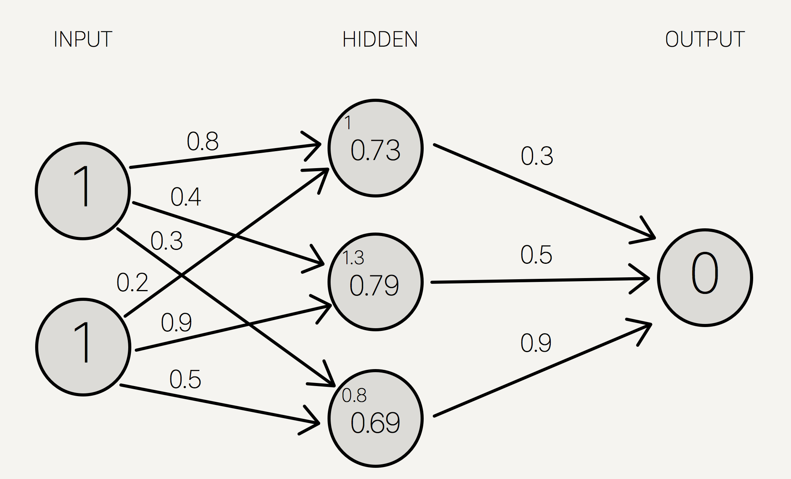
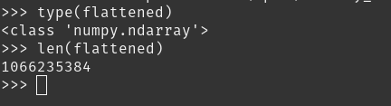

## Introduction

A Stable Diffusion model, whether a complete copy or a LoRa, is just a Pytorch model - and a Pytorch model like any neural net, is just a series of floating point numbers. These are contained within tensors, a form of array, and most models exist as a list of tensors of varying shapes, sizes, and dimensions. Being able to compare them is useful for any form of statistical analysis, or just calculating useful metrics like average difference of values, like we will here.



In this guide, you'll be shown how to convert a PyTorch model into a one-dimensional array of floating point numbers, and back again, in the following process:
- Extracting the structure from a .ckpt file.
- "Flattening" the structure into a 1D Numpy array 
- Reformatting this array back to the original format of the model.
- Repackaging this into a .ckpt file once more.

## Extraction

A .ckpt file is just a Python dictionary that's been saved to disk using the 'pickle' module. The Pytorch module has [a load method](https://pytorch.org/docs/stable/generated/torch.load.html#torch.load) for loading this into a program. Run the following code in a REPL:
```python
>>> import torch
>>> tensor_dict = torch.load("<name-of-model>.ckpt", map_location="cpu")
```

Feel free to look at the dictionary. If you're working with a LoRa, it's a bunch of key-value pairs where the keys are strings and the values are floating point numbers. If you have a full SD model, it consists of a single key-value pair, with the key being the string ```state_dict```, and the value being another dictionary. _That_ dictionary contains 1131 key-value pairs, each value being the Pytorch ```Tensor``` objects that contain the numbers we're interested in.

All further instructions will be for LoRas, just add "[state_dict]" to references to the dictionary to get it working for a full model.

Now that we know the structure, we can extract those ```Tensor``` objects into a list, like so:

```python
>>> tensors = list(tensor_dict.values()) 
```
We're also going to need to keep that dictionary structure for later when we want to convert back to a .ckpt file. To simplify things, and free up some memory, we'll set all the values to 0, and keep the keys the same.
```python
>>> new_dict = dict()
>>> for k in list(tensor_dict.keys()): 
... 	new_dict[k] = 0 
```

## Flattening

Now to actually flatten the tensors. First, we'll convert them all to Numpy arrays, which ```Pytorch``` provides an in-built method for.

```python
>>> tensors = [t.numpy() for t in tensors]
```

Then, we perform the flattening itself. First we'll make the following function to take a single tensor array and flatten it:

```python
def flatten(matrix):
    shapes = [a.shape for a in matrix]
    offsets = [a.size for a in matrix]
    offsets = numpy.cumsum([0] + offsets)
    result = numpy.concatenate([a.flat for a in matrix])
    return result, shapes, offsets
```

While you could type that out in the REPL, I'd recommend you put this in it's own .py file. Then you can use it in a REPL with an import or with 

```python
>>> exec(open("<file>.py).read())
```

Then, we use this function in another function that applies this method to a list of different matrices:

```python
def list_flatten(matrix_list):
    result = numpy.array([])
    shapes = []
    offsets = []
    limits = [0]

    for a in matrix_list:
        r, s, o = flatten(a)
        result = numpy.append(result, r)
        shapes.append(s)
        offsets.append(o)
        limits.append(len(result))
    return result, shapes, offsets, limits
```
```python
>>> flattened, shapes, offsets, limits = list_flatten(tensors)
```
Now you have your 1D array! We can now manipulate it as we please. For example, let's see how many floating point numbers are in the whole model:



## Comparing

Now that we have our flattened data, comparing is fairly simple:
```python
diffs = numpy.abs(model_a_weights - model_b_weights)
av_difference = numpy.average(diff)
```

numpy does the heavy lifting here. The subtraction of the two arrays gives an array of every value subtracted by its corresponding value; numpy.abs takes this and sets each number to its absolute value; and numpy.average return the average value for this entire array.

# Conclusion

Mathematical comparison is a great way to see how different training datasets and parameters affect the training, whether Dreambooth or LoRa. By iterating and averaging these difference values, you can even calculate how different a model is, on average, to a whole set of others.